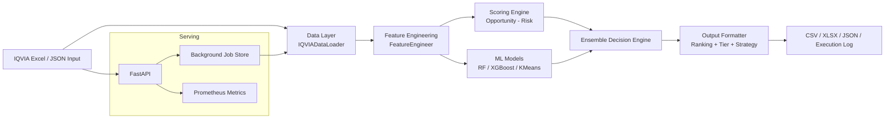

# Molecule Decision System

Production-oriented analytics platform for **pharmaceutical molecule investment decisions** using IQVIA MAT data.

It combines rule-based market scoring with machine learning, serves asynchronous analysis through a FastAPI API, and exposes Prometheus metrics for operations.

## Table of Contents
- [Overview](#overview)
- [Architecture](#architecture)
- [Core Capabilities](#core-capabilities)
- [Repository Structure](#repository-structure)
- [Prerequisites](#prerequisites)
- [Installation](#installation)
- [Data Requirements](#data-requirements)
- [Quick Start](#quick-start)
- [Run the API](#run-the-api)
- [Docker Deployment](#docker-deployment)
- [API Endpoints](#api-endpoints)
- [Configuration](#configuration)
- [Outputs](#outputs)
- [Monitoring & Observability](#monitoring--observability)
- [Operational Notes](#operational-notes)

## Overview
The system ingests molecule-country IQVIA records, engineers market features, computes opportunity and risk scores, applies ML predictions, and produces ranked recommendations with confidence and investment tiers.

**Tier cutoffs (default):**
- **High Potential**: `score >= 70`
- **Moderate**: `50 <= score < 70`
- **Avoid**: `score < 50`

## Architecture


### Pipeline modules
| Module | Class | Responsibility |
|---|---|---|
| `data_layer.py` | `IQVIADataLoader` | Data loading, validation, cleaning, quality scoring |
| `feature_engineering.py` | `FeatureEngineer` | Market metrics (growth, concentration, volatility, lifecycle, etc.) |
| `scoring_engine.py` | `ScoringEngine` | Rule-based opportunity/risk scoring with business penalties |
| `ml_models.py` | `MLModels` | Train/load RF, XGBoost (optional), KMeans |
| `ensemble.py` | `EnsembleDecisionEngine` | Combines rule-based + ML scores into final decision/confidence |
| `output_formatter.py` | `OutputFormatter` | Ranking, tiering, strategy output and summary |
| `pipeline.py` | `run_pipeline(df)` | End-to-end orchestration |
| `main.py` | FastAPI app | Async analysis API, model reload, health and metrics |
| `train_models.py` | — | One-shot model training and artifact generation |

## Core Capabilities
- IQVIA schema validation and cleaning
- Feature engineering for market attractiveness and risk
- Dual-scoring framework (opportunity minus risk)
- Ensemble decisioning with confidence classes
- Async API with background jobs and polling
- Hot model retraining endpoint
- Structured logging + Prometheus metrics

## Repository Structure
```text
.
├── main.py                  # FastAPI server
├── pipeline.py              # Orchestrator + run_pipeline(df)
├── train_models.py          # Offline training script
├── data_layer.py
├── feature_engineering.py
├── scoring_engine.py
├── ml_models.py
├── ensemble.py
├── output_formatter.py
├── config.py                # Centralized weights/thresholds
├── logging_config.py
├── metrics.py
├── schemas.py               # Pydantic API contracts
├── docker-compose.yml       # API + Prometheus + Grafana
├── Dockerfile
├── requirements.txt
└── models/
    └── v1/                  # Serialized model artifacts
```

## Prerequisites
- Python 3.10+
- pip
- IQVIA Excel workbook for training/inference
- Optional: `xgboost` package for forecasting model support

## Installation
```bash
python -m venv .venv
source .venv/bin/activate   # Windows PowerShell: .\.venv\Scripts\Activate.ps1
pip install -r requirements.txt
```

Optional XGBoost:
```bash
pip install xgboost
```

## Data Requirements
Input data must follow the IQVIA structure expected by `IQVIADataLoader` (required hierarchy columns and MAT revenue/volume columns). API requests are validated and rejected (`422`) when required fields are missing.

## Quick Start
### 1) Train models (recommended before inference)
```bash
python train_models.py "IQVIA - Leah .xlsx"
```
Artifacts are saved under `models/v1/` (RF classifier/scaler, XGBoost if available, KMeans, metadata).

### 2) Run batch pipeline (file-based)
```bash
python pipeline.py
```
`pipeline.py` expects the workbook at `./IQVIA - Leah .xlsx` and writes outputs to `./output/`.

### 3) Run pipeline as a function
```python
import pandas as pd
from pipeline import run_pipeline

df = pd.read_excel("IQVIA - Leah .xlsx", sheet_name="Sheet1")
results = run_pipeline(df, models_dir="models/v1")
```

## Run the API
```bash
uvicorn main:app --reload
```

By default:
- API docs: `http://localhost:8000/docs`
- Health: `http://localhost:8000/health`
- Metrics: `http://localhost:8000/metrics`

## Docker Deployment
> Train models first on the host (`python train_models.py ...`) so `./models` has artifacts.

```bash
docker compose up --build
```

Services:
- API: `http://localhost:8000`
- Prometheus: `http://localhost:9090`
- Grafana: `http://localhost:3000` (`admin/admin`)

## API Endpoints
| Method | Path | Auth | Description |
|---|---|---|---|
| `POST` | `/analyze` | Yes* | Upload `.xlsx/.xls`, returns `job_id` (202) |
| `POST` | `/analyze/json` | Yes* | Submit IQVIA-compatible records as JSON, returns `job_id` |
| `GET` | `/jobs/{job_id}` | Yes* | Poll status/result (`queued/running/complete/failed`) |
| `POST` | `/train` | Yes* | Retrain models and hot-reload in memory |
| `GET` | `/model/info` | Yes* | Model load/training metadata |
| `GET` | `/health` | No | Liveness and model readiness |
| `GET` | `/metrics` | No | Prometheus metrics |
| `GET` | `/docs` | Yes* | Swagger UI |

\* Authentication is enforced only when `API_KEY` is set. If unset, API runs in dev mode without auth.

## Configuration
All scoring and model behavior is centralized in `config.py`.

Key sections:
- `WEIGHTS`
- `RISK_WEIGHTS`
- `THRESHOLDS`
- `ML`
- `CONFIDENCE`
- `TIER_CUTOFFS`

Common environment variables:
- `API_KEY` (enable API key auth)
- `LOG_FORMAT` (`json` or `console`)
- `TRAINING_DATA_PATH` (default data source for `/train`)
- `HOST`, `PORT`, `WORKERS` (server runtime)

## Outputs
Batch pipeline writes to `./output/`:
- `molecules_ranked.csv`
- `molecules_top50.xlsx`
- `analysis_summary.json`
- `execution_log.txt`

## Monitoring & Observability
- Structured logging via `structlog`
- `X-Request-ID` added to responses and logs
- Prometheus auto HTTP metrics + domain metrics:
  - `pharma_pipeline_runs_total{status}`
  - `pharma_tier_molecules_total{tier}`
  - `pharma_confidence_molecules_total{confidence_class}`
  - `pharma_model_info`

## Operational Notes
- Use `WORKERS=1` for API deployment (job store is in-memory per process).
- XGBoost is optional; pipeline degrades gracefully if unavailable.
- Model loading/inference failures fall back to safe defaults where implemented.
